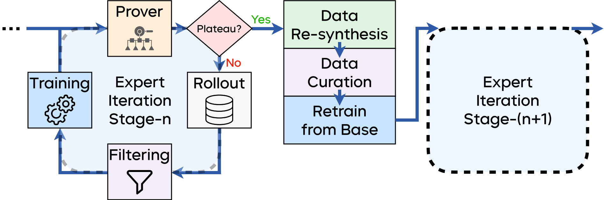
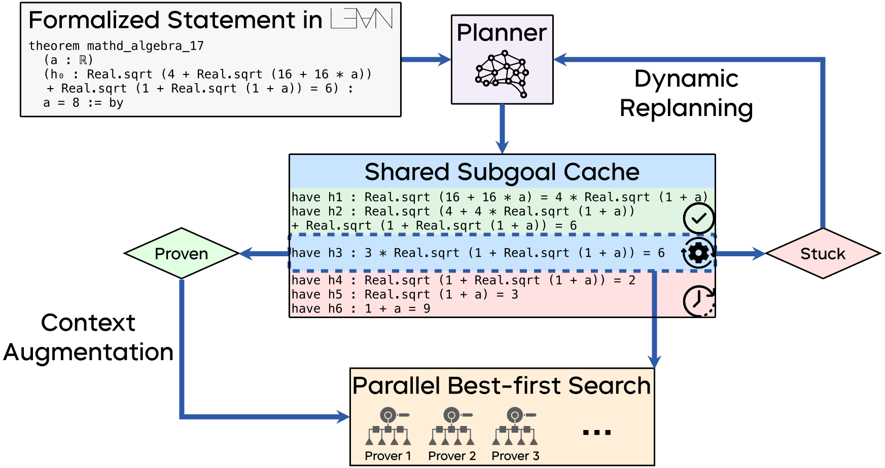

<!-- markdownlint-disable first-line-h1 -->
<!-- markdownlint-disable html -->
<!-- markdownlint-disable no-duplicate-header -->

<div align="center">
  
</div>

<hr>

<h1 align="center" style="font-weight: bold; border-bottom: none; margin-bottom: 0;">
BFS-Prover-V2: Scaling up Multi-Turn Off-Policy RL and Multi-Agent Tree Search for LLM Step-Provers
</h1>

<div align="center" style="line-height: 1;">
  <a href="https://bfs-prover.github.io/V2/">
    
  </a>
  <a href="https://arxiv.org/abs/2509.06493">
    
  </a>
  <a href="https://huggingface.co/collections/ByteDance-Seed/bfs-prover-68db961a5fdf9de045440230">
    
  </a>
  <a href="https://github.com/cmu-l3/llmlean">
    
  </a>
  <a href="LICENSE">
    
  </a>
</div>

<p align="center">
  <a href="#introduction">Introduction</a> |
  <a href="#technical-overview">Technical Overview</a> |
  <a href="#benchmark-performance">Performance</a> |
  <a href="#use-bfs-prover-v2-in-lean-via-llmlean">Use in Lean</a> |
  <a href="#run-proof-search-from-repository">Proof Search</a> |
  <a href="#citation">Citation</a>
</p>

## Introduction

We introduce **BFS-Prover-V2**, the state-of-the-art open-source step-level theorem proving system for Lean4, designed to address the dual challenges of scaling both training and inference in neural theorem proving. BFS-Prover-V2 introduces novel solutions to overcome these limitations through:

1. **Training-time scaling**: A novel multi-stage expert iteration framework with adaptive tactic-level data filtering and periodic retraining to surmount the performance plateaus that typically curtail long-term post training
2. **Inference-time scaling**: A planner-enhanced multi-agent tree search system for hierarchical reasoning that scales performance at inference time

**BFS-Prover-V2** achieves 95.08\% and 41.4\% on the miniF2F and ProofNet test sets respectively, setting a new state-of-the-art for step-level provers.

## Technical Overview

### Scaling up training

<div align="center">
  
  <p>Figure: <em>Overview of the multi-stage expert iteration framework</em></p>
</div>

At the start of each training round, the system evaluates the model's performance to determine whether it has plateaued. If the model continues to improve, it entersan inner expert iteration loop involving rollout, tactic filtering, and refinement. Once improvement stalls, the system transitions to the outer retraining loop, which performs data re-synthesis, data curation, and full retraining from the base checkpoint.

### Scaling up inference

<div align="center">
  
  <p>Figure: <em>Overview of the planner-enhanced multi-agent tree search architecture.</em></p>
</div>

The planner agent (a general-purpose reasoning model) decomposes the main theorem into a sequence of simpler subgoals, which are managed in a shared subgoal cache and solved in parallel by multiple prover agents using best-first tree search. Successfully proven subgoals augment the main proof's context, while failures can trigger a dynamic replanning loop.

## Benchmark Performance

<div align="center">

| Model | miniF2F-test | miniF2F-valid | ProofNet-test |
|:------|:------------:|:-------------:|:-------------:|
| BFS-Prover-V2-7B | 82.4% | - | - |
| BFS-Prover-V2-32B | 86.1% | 85.5% | 41.4% |
| BFS-Prover-V2-32B w/ Planner | 95.08% | 95.5% | - |
<p>Table: <em>Benchmark performance of BFS-Prover-V2 series.</em></p>
</div>

## Use BFS-Prover-V2 in Lean (via LLMLean)

<div align="center">
  <video src="./assets/demo.mp4" width="100%" controls>
    Your browser does not support the video tag.
  </video>
</div>

<p align="center">
BFS-Prover-V2 is integrated with <a href="https://github.com/cmu-l3/llmlean">LLMLean</a>, enabling interactive theorem proving in VS Code.
</p>

### Requirements

- Lean 4 ([Installation](https://lean-lang.org/install/))
- Ollama ([Download](https://ollama.com/download))

### Installation

1. Pull BFS-Prover-V2 from Ollama ([32B](https://ollama.com/zeyu-zheng/BFS-Prover-V2-32B)) ([7B](https://ollama.com/zeyu-zheng/BFS-Prover-V2-7B))
```bash
# e.g., for 7B model with 8-bit quantization
ollama pull zeyu-zheng/BFS-Prover-V2-7B:q8_0
```

2. Configure LLMLean for BFS-Prover-V2
```toml
# ~/.config/llmlean/config.toml
api = "ollama"
model = "zeyu-zheng/BFS-Prover-V2-7B:q8_0"
mode = "parallel"
prompt = "tacticstate"
responseFormat = "tactic"
numSamples = "5"
```

3. Add LLMLean to lakefile in your Lean project
```lean
-- lakefile.lean
require llmlean from git "https://github.com/zeyu-zheng/llmlean.git" @ "bfs-pr"
```

or

```toml
# lakefile.toml
[[require]]
name = "llmlean"
git = "https://github.com/zeyu-zheng/llmlean.git"
rev = "bfs-pr"
```

4. Use in Lean
```lean
import Mathlib
import LLMlean

example : ... := by
  llmstep ""  -- Get suggestion for next tactic
  -- or
  llmstep "rw"  -- Get suggestion for using tactic `rw` next
```

## Run Proof Search from Repository

### Requirements

- Python 3.11
- Lean 4 ([Installation](https://lean-lang.org/install/))
(Version compatibility follows LeanDojo 2.1.3, has been tested under Lean 4.10.0.)
- CUDA-compatible GPU

### Installation

1. Pull BFS-Prover-V2 from Hugging Face ([32B](https://huggingface.co/ByteDance-Seed/BFS-Prover-V2-32B)) ([7B](https://huggingface.co/ByteDance-Seed/BFS-Prover-V2-7B))

2. Clone and install the repository

```bash
# Clone the repository
git clone https://github.com/ByteDance-Seed/BFS-Prover-V2.git
cd BFS-Prover-V2

# Install dependencies
pip install .
```

3. Trace your Lean repository for proof search with LeanDojo

```python
from lean_dojo import *

url = URL
commit = COMMIT_HASH
repo = LeanGitRepo(url, commit)
trace(repo)
```

4. Prepare the data for proof search

The repository includes sample data for planning and proof search in `src/data`.

### Plan Generation and Replanning

1. Configure the planner model and data path in `src/plan/config.yaml`

**Important**: Ensure that the `statement_file` and `dojo_data_file` contain matching theorems. Each theorem ID in the statement file must have a corresponding entry in the dojo data file. Mismatched data will cause verification errors.

For a quick start, you can use the provided demo data:
- Set `dojo_data_file: "src/data/demo_dojo.jsonl"`
- Set `statement_file: "src/data/demo_statements.jsonl"`

These demo files contain 7 matching theorems from the miniF2F test set.

2. (Optional) To use local models, launch a vLLM server

```bash
vllm serve --model /PATH/TO/YOUR/PLANNER_MODEL --port 8000 --reasoning_parser YOUR_REASONING_PARSER
```

3. Generate a plan for the theorems in dataset

```bash
bash src/plan/run_local_plan.sh
```

4. (Optional) Replan the theorems when the proof search gets stuck

```bash
bash src/plan/run_local_replan.sh
```

### Proof Search

1. Configure the proof search parameters in `src/search/run_local_search.sh`

For a quick start with demo data, you can use:
- Set `--file_path` to `src/data/demo_dojo.jsonl`
- Set `--plan_file` to `src/data/demo_plan.json`

The `demo_plan.json` contains pre-generated plans for the 7 demo theorems that can be used directly for proof search.

2. Run the proof search:

```bash
bash src/search/run_local_search.sh
```

## Citation
```bibtex
@article{xin2025scaling,
  title={Scaling up Multi-Turn Off-Policy RL and Multi-Agent Tree Search for LLM Step-Provers},
  author={Xin, Ran and Zheng, Zeyu and Nie, Yanchen and Yuan, Kun and Xiao, Xia},
  journal={arXiv preprint arXiv:2509.06493},
  year={2025}
}
```

## License
This project is licensed under the [Apache License 2.0](LICENSE).
